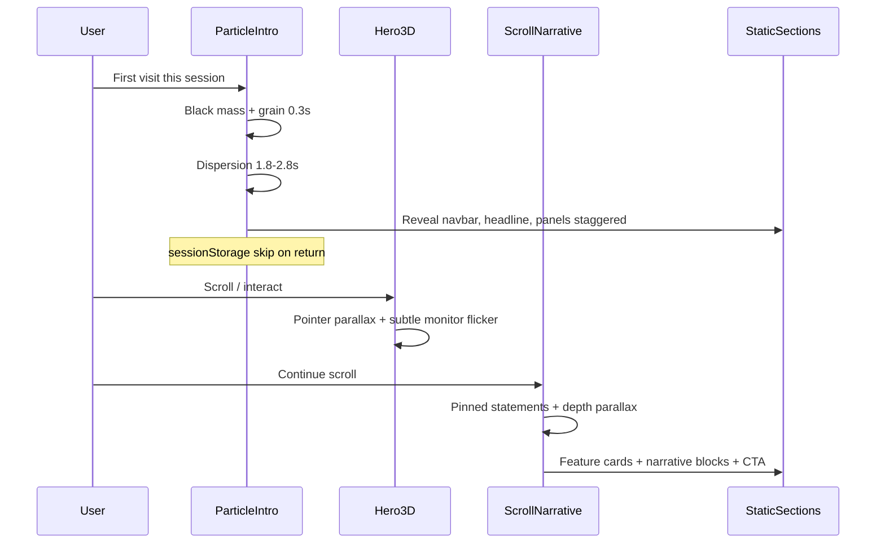

# NexaAssist premium cinematic homepage (multitask plan)

## Current baseline

- Single file: [`frontend/app/page.tsx`](frontend/app/page.tsx) — static hero, CSS skeleton “monitor,” four one-line cards.
- Tokens already match your direction: deep charcoal (`--na-bg`, `--na-bg-deep`), muted text, metallic blue accent (`--na-accent`, `--na-accent-solid`), cyan status (`--na-cyan`) in [`frontend/app/globals.css`](frontend/app/globals.css).
- **No** animation or 3D deps in [`frontend/package.json`](frontend/package.json) today (lockfile may mention GSAP; reconcile on install).

## Runtime experience order (what users see)



**Your three “3D phases” mapped clearly:**

| Phase | Reference | Purpose |
|-------|-----------|---------|
| **0 — Intelligence boot** | Your particle brief | Session-first loader; black mass disperses into real DOM (not a separate fake UI) |
| **1 — Workstation hero** | [shader.se](https://www.shader.se/) | Full-viewport 3D retro computer; editorial serif headline left; monitor shows NexaAssist OS |
| **2 — Scroll command center** | [mhdyousuf.me](https://www.mhdyousuf.me/) | Pinned viewport storytelling, wireframe depth, monospace `//` labels, progressive copy reveals |

**Build order (multitask):** Phase **content/layout** first → Phase **1 hero 3D** + Phase **2 scroll** in parallel → Phase **0 particle** last (must mask final DOM). Particle is built last but plays first at runtime.

---

## Master agent brief (paste to any implementation agent)

Use this as the single source of truth so parallel agents do not drift:

> **Product:** NexaAssist — multi-tenant business operations SaaS (appointments, inventory, chatbot, campaigns).  
> **Page:** Marketing homepage only (`/`). Do not change dashboard/auth routes.  
> **Mood:** Dark, premium, enterprise command center initializing — **not** cyberpunk, gaming, or neon overload.  
> **Palette:** `#0d0e0f` / `#121414` base; text `#e2e2e2`; muted `#c1c7d3`; accent `#a4c9ff` / `#4d93e5`; cyan `#46eaed` for status only.  
> **Hero headline (serif, large, left):** “Unified intelligence for modular business operations.”  
> **Hero subcopy (sans, muted):** “Orchestrate appointments, inventory, campaigns, and AI-assisted workflows from one secure multi-tenant workspace.”  
> **CTAs:** Get started → `/auth/register`; Sign in → `/auth/login`; Open dashboard → `/dashboard`.  
> **Monitor flicker lines (rotate subtly, 3–5s cycle, opacity pulse 0.7–1):** NexaAssist OS · Tenant secured · Status: operational · Assistant ready · Appointments · Inventory · Chatbot · Campaigns · Live queue · Low stock alert · New appointment slot available.  
> **Motion rules:** GSAP ease `power2.out` / `power3.inOut`; max intro 2.8s; respect `prefers-reduced-motion` (skip intro, show final layout, disable parallax).  
> **Intro:** Once per **session** via `sessionStorage` key `nexaassist_intro_seen`.  
> **3D:** Stock CC0 GLB retro workstation; screen = textured plane with HTML/CSS dashboard preview or `drei` `RenderTexture`.  
> **Scroll:** ScrollTrigger pinned sections ~100–140vh; wireframe/canvas background parallax; stagger text with opacity + `translateY(24px)` + light blur decay.

---

## Proposed file architecture

Split the 145-line page into focused client islands (all WebGL/canvas/GSAP behind `dynamic(..., { ssr: false })`):

```
frontend/
  app/page.tsx                    # Server: metadata + <HomeExperience />
  components/landing/
    HomeExperience.tsx            # Orchestrator: intro gate, sections, reduced-motion
    copy.ts                       # All marketing strings (single edit surface)
    ParticleIntro.tsx             # Canvas + mask reveal (Phase 0)
    LandingNav.tsx
    HeroSection.tsx               # Layout: headline + HeroScene slot
    hero/
      HeroScene.tsx               # R3F Canvas
      ComputerModel.tsx           # GLB + lights
      MonitorScreen.tsx           # Screen content + flicker
    scroll/
      ScrollNarrative.tsx         # ScrollTrigger driver
      PinnedChapter.tsx           # Reusable pinned block
      WireframeDepth.tsx          # Canvas or lightweight R3F plane
    FeatureOverview.tsx           # 4 expanded cards
    NarrativeBlocks.tsx           # Industry / workflow copy
    FinalCta.tsx
  lib/landing/
    motion.ts                     # prefers-reduced-motion, session intro flag
    screenStates.ts               # Monitor flicker rotation config
public/
  models/workstation.glb          # Optimized stock model (<2MB target)
```

[`frontend/app/layout.tsx`](frontend/app/layout.tsx): add **editorial serif** for hero only (e.g. `Instrument_Serif` or `Playfair_Display` via `next/font/google` as `--font-display`); keep Inter for UI body.

---

## Track A — Content and layout (no WebGL; unblock others)

**Owner focus:** structure + copy + responsive grid.

1. Expand four cards in `copy.ts` — each: title, one-line summary, 2–3 sentence body, optional mono tag (e.g. `// scheduling`).
2. Add sections from your spec:
   - Feature overview (4 cards)
   - Pinned narrative chapters: multi-tenant, RBAC, appointments/calendar, inventory alerts, AI assistant, notifications, campaigns
   - Expanded case-study-style blocks (portfolio density, not startup fluff)
   - Final CTA band
3. Replace decorative header with real nav links: Home, Product (anchor), Contact (placeholder or `mailto:`), CTAs right.
4. Wire semantic HTML + `aria` for sections; ensure page is usable with JS disabled (content visible, motion off).

**Acceptance:** Long-scroll page reads well with zero animation; Lighthouse text/structure OK.

---

## Track B — Phase 1: 3D workstation hero (Shader-like)

**Dependencies to add:** `three`, `@react-three/fiber`, `@react-three/drei`, `gsap`, `@gsap/react` (register `ScrollTrigger` only in scroll track).

**Scene spec:**

- Camera: slight 3/4 angle, FOV ~35–45, object right-weighted (headline left open).
- Lighting: 1 key + 1 rim + ambient; subtle purple haze via fullscreen CSS gradient behind canvas (not in Three fog — cheaper).
- Model: Agent sources CC0 “retro computer” GLB; run `gltf-transform` or similar to compress; place in `public/models/`.
- **Monitor:** separate mesh material → `MeshBasicMaterial` map from:
  - **Preferred:** offscreen DOM (`MonitorScreen`) captured with `drei` `RenderTexture`, or
  - **Fallback:** static texture from designed 664×500 dashboard PNG.
- **Screen UI inside monitor:** miniature dashboard using existing tokens — sidebar strip, 2 metric cards, queue row, pulsing cyan dot; GSAP timeline loops soft panel entrances.
- **Interaction:** `useFrame` or GSAP: ±3° rotation on pointer; scroll-linked micro-tilt (0–5°) while hero in view.
- **Mobile:** smaller canvas, lower DPR cap (`dpr={[1, 1.5]}`), optional static poster image below `md` if WebGL fails.

**Flicker implementation:** cycle `screenStates.ts` strings; apply CSS `animation: monitorFlicker 4s steps(1)` on text rows + scanline overlay (`repeating-linear-gradient`, 3% opacity).

**Acceptance:** 60fps on mid desktop; hero readable; reduced-motion shows static poster + same copy.

---

## Track C — Phase 2: Scroll narrative (MHD Yousuf–like)

**Pattern:** 2–3 **pinned** chapters (~100vh each) with scroll-scrubbed progress `0→1`.

Per chapter:

- Full-viewport fixed layer: [`WireframeDepth.tsx`](frontend/components/landing/scroll/WireframeDepth.tsx) — **2D canvas** drawing cyan (`--na-cyan`) grid/waves + stacked ring “towers” (cheaper than full terrain mesh; matches reference image).
- Foreground: large statement + supporting paragraph (enterprise tone).
- Monospace label top-left: `// multi_tenant_workspace`, etc.
- Optional “Ask” bar styling (decorative, non-functional) mid-page for portfolio feel — copy aligned to NexaAssist (“Ask about inventory thresholds…”).

**Scroll techniques (GSAP ScrollTrigger):**

- `pin: true` on chapter wrapper
- `scrub: 0.5` for background parallax
- Stagger children: `opacity: 0 → 1`, `y: 40 → 0`, `filter: blur(8px) → blur(0)`
- Between chapters: normal flow for feature grid + narrative blocks

**Optional:** `lenis` smooth scroll — only if native scroll feels harsh after testing; adds bundle + sync care with ScrollTrigger.

**Acceptance:** No pin overlap bugs; `ScrollTrigger.refresh()` on resize; reduced-motion = unpinned static stack.

---

## Track D — Phase 0: Particle dispersion intro (build last)

**Approach (your Option 1):** 2D canvas particles + CSS mask on overlay — **not** Three.js dissolve.

**Mechanics:**

1. Full-screen `#000` overlay z-50 on first session load.
2. Faint noise grain (CSS `background-image` or tiny canvas noise).
3. Center label 0.4s: “NexaAssist initializing” (mono, cyan, low opacity) — then fade before dispersion.
4. ~800–1200 particles from grid sampling of overlay alpha; burst outward with weighted velocity, size variance, depth-based blur class.
5. Overlay opacity → 0; particles fade by 2.8s.
6. **Reveal targets** (real DOM, `data-reveal` hooks): gradients → nav → headline → hero canvas container → feature cards — GSAP timeline synced at ~40% dispersion progress.
7. On complete: remove overlay, set `sessionStorage`, enable pointer parallax.

**Premium optional:** last 20% of particles ease toward nearest card/nav edge positions (subtle “particles become UI” — keep count low to avoid clutter).

**Acceptance:** Skips entirely when `sessionStorage` set or `prefers-reduced-motion`; no layout shift after removal; no scroll lock after intro.

---

## Copy deck (implement in `copy.ts`)

**Hero:** as in master brief.

**Four feature cards (expanded):**

| Card | Summary | Supporting |
|------|---------|------------|
| Appointments | Unified scheduling and booking | Calendars, slots, service types, and status history in one tenant-scoped flow. |
| Inventory | Stock you can trust | Movements, thresholds, restock requests, and alerts surfaced before shortages disrupt operations. |
| Chatbot | Assistant with guardrails | Tenant-scoped tools, safe actions, and operational answers — not a generic chat widget. |
| Campaigns | Outreach with accountability | Queues, channels, and delivery signals tied to real business outcomes. |

**Narrative chapters (pinned):** one H2 + 2–3 sentences each for: multi-tenant workspace, role-based access, appointment workflow, inventory monitoring, AI assistant flow, notification escalation, campaign generation.

**Final CTA:** “Start operating from one workspace.” + Get started / Sign in.

---

## Dependencies and config

Add to [`frontend/package.json`](frontend/package.json):

- `three`, `@react-three/fiber`, `@react-three/drei`
- `gsap`, `@gsap/react`
- Dev: `@types/three` if needed

Update [`frontend/next.config.ts`](frontend/next.config.ts) if required for GLB imports (`webpack` asset rule — usually automatic for `public/`).

Run `npm install` in `frontend/` and refresh lockfile (remove stale GSAP/playwright drift).

---

## Multitask execution matrix

| Track | Can start | Blocks | Parallel with |
|-------|-----------|--------|----------------|
| A Content/layout | Immediately | B/C need section IDs | — |
| B Hero 3D | After hero layout + `copy.ts` | — | C |
| C Scroll narrative | After section anchors exist | — | B |
| D Particle intro | After A+B+C DOM stable | Launch | — |

**Suggested agent split:**

1. **Agent Content** — Track A + `copy.ts` + fonts in layout  
2. **Agent Hero3D** — Track B + GLB sourcing/optimization  
3. **Agent Scroll** — Track C + GSAP ScrollTrigger  
4. **Agent Intro** — Track D after merge review  

Integration owner: `HomeExperience.tsx` wires intro gate → hero → scroll sections.

---

## Performance and accessibility checklist

- Dynamic import all canvas/WebGL; `loading` poster for hero.
- `dpr` cap, `frameloop="demand"` when idle if using invalidate pattern.
- `prefers-reduced-motion`: skip intro; static hero image; disable pin/scrub.
- `will-change: transform` only during active tweens.
- Target intro &lt; 2.8s; total JS for landing &lt; ~250KB gzipped incremental (monitor bundle).
- Test: mobile Safari + mid-tier Android; verify session intro skip.

---

## Verification (before calling done)

1. First load in fresh session: particle → full reveal → hero 3D visible.  
2. Reload same tab: no particle; hero immediate.  
3. New tab/session: particle plays again.  
4. Scroll: pinned chapters scrub smoothly; feature + narrative text denser than current 4 one-liners.  
5. Reduced motion: no overlay, no pin, content complete.  
6. `cd frontend && npm run build` passes.

---

## Risk notes

- **GLB screen alignment:** may need manual UV/mesh name discovery in Blender — budget time for monitor mesh ID.  
- **ScrollTrigger + R3F:** refresh triggers after intro completes (`ScrollTrigger.refresh()`).  
- **Scope creep:** defer “particles align into chart lines” to v2 unless Track D finishes early.
