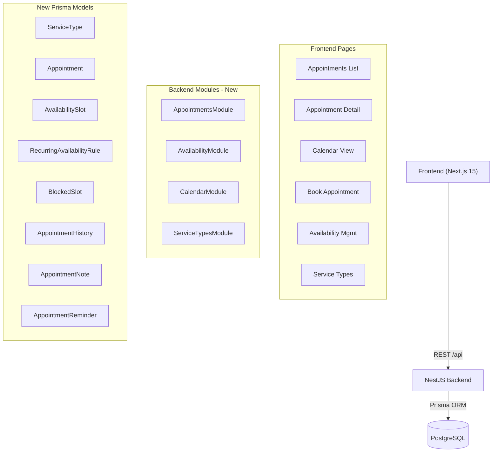

# Phase 3 — Appointment & Calendar System

## Architecture Overview



## 1 — Database Schema (`backend/prisma/schema.prisma`)

New enums:
- `AppointmentStatus`: `PENDING | CONFIRMED | COMPLETED | CANCELLED | RESCHEDULED | NO_SHOW`
- `AppointmentSource`: `DASHBOARD | PUBLIC_BOOKING | CHATBOT | ADMIN_CREATED`
- `RecurrenceType`: `DAILY | WEEKLY | MONTHLY`
- `SlotType`: `AVAILABLE | BREAK | BLOCKED`

New models (all with `tenantId` FK for multi-tenant isolation, indexed):

- **`ServiceType`** — `id, tenantId, name, durationMinutes, colorCode, isActive`
- **`Appointment`** — `id, tenantId, appointmentCode, customerId, assignedStaffId, createdById, serviceTypeId, title, description, startTime, endTime, timezone, status, source, cancellationReason, rescheduledFromId` (self-relation), `createdAt, updatedAt`
- **`AvailabilitySlot`** — `id, tenantId, staffId, startTime, endTime, slotType, isAvailable, recurrenceGroupId`
- **`RecurringAvailabilityRule`** — `id, tenantId, staffId, dayOfWeek, startHour, endHour, recurrenceType, effectiveFrom, effectiveUntil`
- **`BlockedSlot`** — `id, tenantId, staffId, reason, blockedFrom, blockedTo`
- **`AppointmentHistory`** — `id, appointmentId, actionType, previousValue (JSON), newValue (JSON), performedById, createdAt`
- **`AppointmentNote`** — `id, appointmentId, tenantId, content, createdById, createdAt`
- **`AppointmentReminder`** — `id, appointmentId, scheduledAt, channel, sent` (future-ready placeholder)

Relation additions to `User`: `appointmentsAsCustomer`, `appointmentsAsStaff`, `availabilitySlots`, `blockedSlots`, `appointmentHistoryEntries`

Migration name: `20260515_appointments_calendar`

## 2 — Backend Modules

### 2a. `ServiceTypesModule`
- **Files**: `src/service-types/service-types.{module,controller,service}.ts`, `dto/service-types.dto.ts`
- Routes: `POST/GET /service-types`, `PATCH/DELETE /service-types/:id`
- Guards: `@Roles(TENANT_ADMIN)` for write, `@Permissions('service-types:read')` for read

### 2b. `AvailabilityModule`
- **Files**: `src/availability/availability.{module,controller,service}.ts`, `dto/availability.dto.ts`
- Routes:
  - `POST /availability` — create slot or recurring rule
  - `GET /availability?staffId=&from=&to=` — query slots in range
  - `PATCH /availability/:id`
  - `DELETE /availability/:id`
  - `POST /availability/blocked` — create blocked slot
  - `GET /availability/blocked`
  - `DELETE /availability/blocked/:id`
- Service method `computeAvailableSlots(tenantId, staffId, date)` — merges recurring rules → concrete slots, then subtracts blocked ranges and existing confirmed/pending appointments

### 2c. `AppointmentsModule` (core)
- **Files**: `src/appointments/appointments.{module,controller,service}.ts`, `dto/appointments.dto.ts`
- Routes per spec (`/appointments`, `/appointments/:id`, `/appointments/:id/cancel`, `/appointments/:id/reschedule`, `/appointments/:id/complete`)
- **Double-booking prevention** — in `create()` and `reschedule()`:

```typescript
await this.prisma.$transaction(async (tx) => {
  const overlap = await tx.appointment.findFirst({
    where: {
      tenantId,
      assignedStaffId,
      status: { in: ['PENDING', 'CONFIRMED'] },
      startTime: { lt: dto.endTime },
      endTime: { gt: dto.startTime },
    },
  });
  if (overlap) throw new ConflictException('Time slot is already booked');
  // create appointment + appointmentHistory entry in same tx
});
```

- History entry created on every state transition (create, confirm, cancel, reschedule, complete)
- Future-ready event hook: `this.eventEmitter.emit('appointment.created', payload)` (EventEmitter2 wired but no consumers yet)

### 2d. `CalendarModule`
- **Files**: `src/calendar/calendar.{module,controller,service}.ts`
- Routes: `GET /calendar/day?date=`, `GET /calendar/week?date=`, `GET /calendar/month?date=`
- Service queries appointments + availability + blocked slots for the requested range, returns a unified payload for the frontend calendar grid

### 2e. Permissions seed
Update `backend/prisma/seed.ts` to add permissions:
```
appointments:create, appointments:read, appointments:update, appointments:cancel,
availability:read, availability:write,
service-types:read, service-types:write,
calendar:read
```
Assign to roles: ADMIN gets all, DOCTOR/STAFF gets own-scoped subset, CUSTOMER gets `appointments:create` + own-read + `calendar:read`

### 2f. `app.module.ts` update
Add `AppointmentsModule`, `AvailabilityModule`, `CalendarModule`, `ServiceTypesModule` to imports.

## 3 — Frontend

### 3a. New dependencies (`frontend/package.json`)
- `zustand` — lightweight state management
- `date-fns` — date arithmetic and formatting (UTC/timezone safe)

### 3b. Zustand stores
- `frontend/lib/store/appointments.ts` — `useAppointmentsStore`: list, filters (status, staffId, serviceTypeId, dateRange), pagination, selectedAppointment, loading/error
- `frontend/lib/store/calendar.ts` — `useCalendarStore`: viewMode (day/week/month), currentDate, appointmentsCache, loading

### 3c. Pages

| Page | Path | Description |
|---|---|---|
| Appointments List | `/dashboard/appointments` | Table + filters + status badges + quick actions |
| Appointment Detail | `/dashboard/appointments/[id]` | Summary + history timeline + action buttons |
| Calendar View | `/dashboard/calendar` | Day/Week/Month grid with colored blocks |
| Book Appointment | `/dashboard/booking` | 5-step wizard: service → staff → date → slot → confirm |
| Availability Mgmt | `/dashboard/availability` | Weekly grid + recurring rules + blocked slots |
| Service Types | `/dashboard/service-types` | Admin table for service catalog |

### 3d. New shared components (`frontend/components/appointments/`)

- `StatusBadge.tsx` — colored pill for each `AppointmentStatus`
- `AppointmentCard.tsx` — compact card used in calendar blocks and list rows
- `SlotPicker.tsx` — time slot grid, disabled states for unavailable/booked slots
- `HistoryTimeline.tsx` — vertical timeline of `AppointmentHistory` entries
- `CalendarGrid.tsx` — day/week/month layout switcher + rendered cells
- `BookingWizard.tsx` — multi-step form orchestrator
- `AvailabilityGrid.tsx` — weekly hours grid for schedule management
- `AppointmentFilters.tsx` — filter bar for list page (date range, status, staff, service)

### 3e. Sidebar update
Add `Calendar` and `Availability` nav items with appropriate permission guards to `frontend/components/dashboard/Sidebar.tsx`.

### 3f. Design system
All new UI follows existing CSS tokens (`--na-bg`, `--na-accent`, `--na-cyan`, `--na-surface`, etc.) from `frontend/app/globals.css`. Status colors mapped as CSS classes:
- PENDING → muted amber tint
- CONFIRMED → cyan (`--na-cyan`)
- COMPLETED → muted green
- CANCELLED/NO_SHOW → muted red
- RESCHEDULED → accent blue (`--na-accent`)

## 4 — Key Files Summary

**Modified:**
- [`backend/prisma/schema.prisma`](backend/prisma/schema.prisma) — +~180 lines (enums + 8 models + User relation additions)
- [`backend/prisma/seed.ts`](backend/prisma/seed.ts) — add appointment permissions
- [`backend/src/app.module.ts`](backend/src/app.module.ts) — add 4 module imports
- [`frontend/package.json`](frontend/package.json) — add zustand, date-fns
- [`frontend/components/dashboard/Sidebar.tsx`](frontend/components/dashboard/Sidebar.tsx) — add Calendar + Availability nav items
- [`frontend/app/dashboard/appointments/page.tsx`](frontend/app/dashboard/appointments/page.tsx) — replace placeholder
- [`frontend/app/dashboard/booking/page.tsx`](frontend/app/dashboard/booking/page.tsx) — replace placeholder

**New backend (~18 files):**
`src/appointments/`, `src/availability/`, `src/calendar/`, `src/service-types/` — each with module/controller/service/dto

**New frontend (~15 files):**
`lib/store/appointments.ts`, `lib/store/calendar.ts`, `app/dashboard/appointments/[id]/page.tsx`, `app/dashboard/calendar/page.tsx`, `app/dashboard/availability/page.tsx`, `app/dashboard/service-types/page.tsx`, `components/appointments/*.tsx` (8 components)

## 5 — Implementation Order

Sequentially:
1. Schema + migration + Prisma generate
2. Seed permissions update
3. ServiceTypesModule (simplest, no overlap logic)
4. AvailabilityModule
5. AppointmentsModule (double-booking transactions)
6. CalendarModule
7. `app.module.ts` wire-up
8. Frontend dependencies install
9. Zustand stores
10. Shared components
11. All 6 pages
12. Sidebar update
