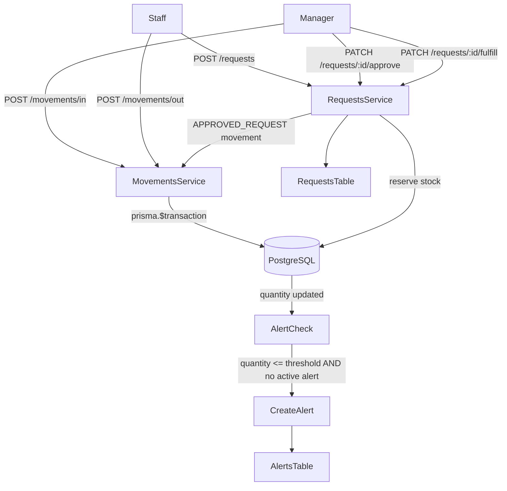

# Phase 4 — Operational Inventory Management

## What exists today

- `inventory:read` / `inventory:write` permissions already seeded
- `INVENTORY_MANAGER` role exists (has both), `STAFF` has `:read`
- Placeholder page at [`frontend/app/dashboard/inventory/page.tsx`](frontend/app/dashboard/inventory/page.tsx)
- No backend module — nothing in [`backend/src/`](backend/src/) for inventory yet

---

## Database — new Prisma models

Migration file: `backend/prisma/migrations/20260515180000_inventory_schema/migration.sql`

Schema additions to [`backend/prisma/schema.prisma`](backend/prisma/schema.prisma):

**New enums**
- `InventoryItemStatus` — `ACTIVE | LOW | OUT_OF_STOCK | ARCHIVED | EXPIRED | DAMAGED | RESTRICTED`
- `MovementType` — `IN | OUT | ADJUSTMENT | RETURN | TRANSFER | APPROVED_REQUEST | DAMAGED | EXPIRED`
- `ReferenceType` — `APPOINTMENT | MANUAL | REQUEST | TRANSFER | EXPIRY`
- `InventoryRequestStatus` — `PENDING | APPROVED | REJECTED | FULFILLED`
- `RequestPriority` — `LOW | NORMAL | HIGH | URGENT`
- `InventoryAlertType` — `LOW_STOCK | OUT_OF_STOCK | OVERSTOCK | DAMAGED | EXPIRING | HIGH_USAGE`
- `AlertSeverity` — `LOW | MEDIUM | HIGH | CRITICAL`
- `AlertStatus` — `ACTIVE | ACKNOWLEDGED | RESOLVED`
- `InventoryTransactionType` — `IN | OUT | ADJUSTMENT | TRANSFER`
- `InventoryTransactionStatus` — `PENDING | COMPLETED | CANCELLED`

**New models**

```
InventoryCategory        id, tenantId, name, description, deletedAt, createdAt
InventoryItem            id, tenantId, categoryId(nullable), name, sku, description,
                         unit, barcode(nullable), locationId(nullable),
                         quantity, reservedQuantity(default 0),
                         minimumThreshold, maximumThreshold(nullable),
                         status(InventoryItemStatus), isActive, createdById,
                         deletedAt(nullable), createdAt, updatedAt
StockMovement            id, tenantId, itemId, movementType, quantity,
                         previousQuantity, newQuantity, reason(nullable),
                         referenceType(ReferenceType nullable), referenceId(nullable),
                         performedById, createdAt  — IMMUTABLE
InventoryRequest         id, tenantId, itemId, requestedById, quantityRequested,
                         approvedQuantity(nullable), fulfilledQuantity(nullable),
                         priority(RequestPriority default NORMAL), reason,
                         status(InventoryRequestStatus), managerNotes(nullable),
                         approvedById(nullable), approvedAt(nullable),
                         createdAt, updatedAt
InventoryAlert           id, tenantId, itemId, type(InventoryAlertType),
                         severity(AlertSeverity), status(AlertStatus default ACTIVE),
                         message, isRead(default false), createdAt, updatedAt
InventoryTransaction     id, tenantId, type, status, notes(nullable),
                         performedById, createdAt, updatedAt
InventoryTransactionItem id, transactionId, itemId, quantity
```

Key architectural decisions baked into schema:
- `availableQuantity = quantity - reservedQuantity` computed at query time
- `locationId nullable` on items, movements, transactions for future multi-location
- `deletedAt` soft-delete on `InventoryCategory` and `InventoryItem`
- `referenceType + referenceId` on `StockMovement` for traceability
- Alert deduplication enforced in service logic (not DB unique constraint — same item can have multiple alert types)

**Tenant model**: add relations for all 6 new models.

---

## Permissions — seed updates

[`backend/prisma/seed.ts`](backend/prisma/seed.ts) additions:

New permission codes (module `inventory`):
- `inventory:approve` — approve/reject requests
- `inventory:request` — submit restock requests
- `inventory:consume` — create OUT movements
- `inventory:alerts` — view and manage alerts
- `inventory:adjust` — create ADJUSTMENT movements

Role map updates:
- `INVENTORY_MANAGER` → add all 5 new codes
- `TENANT_ADMIN` → add all 5 new codes
- `DOCTOR` → add `inventory:read`, `inventory:request`, `inventory:consume`
- `STAFF` → add `inventory:request`, `inventory:consume`
- `RECEPTIONIST` → add `inventory:read`, `inventory:request`

---

## Backend — NestJS module

New directory: `backend/src/inventory/`

```
inventory/
  inventory.module.ts
  dto/
    inventory.dto.ts           ← all DTOs in one file (items, movements, requests, alerts, transactions, dashboard)
  inventory-items.service.ts
  inventory-movements.service.ts
  inventory-requests.service.ts
  inventory-alerts.service.ts
  inventory-transactions.service.ts
  inventory-dashboard.service.ts
  inventory.controller.ts      ← single controller, all routes
```

### Controller routes

```
GET/POST/PATCH/DELETE  /inventory/categories
GET/POST/PATCH/DELETE  /inventory/items
GET/POST               /inventory/items/:id/movements
POST                   /inventory/movements/in
POST                   /inventory/movements/out
POST                   /inventory/movements/adjust
GET                    /inventory/movements
GET/POST               /inventory/requests
PATCH                  /inventory/requests/:id/approve
PATCH                  /inventory/requests/:id/reject
PATCH                  /inventory/requests/:id/fulfill
GET                    /inventory/alerts
PATCH                  /inventory/alerts/:id/acknowledge
PATCH                  /inventory/alerts/:id/resolve
PATCH                  /inventory/alerts/:id/read
GET/POST/GET:id        /inventory/transactions
GET                    /inventory/dashboard
```

### Critical service rules (enforced in code)

1. **Never update `quantity` directly** — all mutations go through `StockMovement` creation inside a `prisma.$transaction`
2. **After every movement** — check `quantity <= minimumThreshold`; if true and no ACTIVE LOW_STOCK alert exists for that item, create one; update item `status` accordingly
3. **On request approval** — increment `reservedQuantity`; on fulfillment — decrement `reservedQuantity`, create `APPROVED_REQUEST` movement, update quantity
4. **Alert deduplication** — `checkAndCreateAlert(itemId)` checks for existing `ACTIVE` alert of same type before inserting
5. All stock change operations wrapped in `prisma.$transaction` for concurrency safety

Register in [`backend/src/app.module.ts`](backend/src/app.module.ts).

---

## Frontend

### New pages

```
frontend/app/dashboard/inventory/
  page.tsx                          ← Dashboard (replaces placeholder)
  items/
    page.tsx                        ← Items list with search/filter
    [id]/
      page.tsx                      ← Item detail + history + requests
  requests/
    page.tsx                        ← Requests (approve/reject for managers; track for staff)
  movements/
    page.tsx                        ← Audit timeline
  alerts/
    page.tsx                        ← Alerts management
  categories/
    page.tsx                        ← Category CRUD
```

### New components

```
frontend/components/inventory/
  InventoryMetricsBar.tsx           ← top metrics (total items, low stock count, critical alerts, pending requests)
  InventoryItemsTable.tsx           ← searchable paginated table
  InventoryItemStatusBadge.tsx      ← colored badge for item status
  StockMovementTimeline.tsx         ← audit timeline
  InventoryRequestsTable.tsx        ← with approve/reject inline actions
  InventoryAlertsList.tsx           ← alert cards with lifecycle actions
  AddStockModal.tsx                 ← IN movement form
  ConsumeStockModal.tsx             ← OUT movement form
  AdjustStockModal.tsx              ← ADJUSTMENT movement form
  RestockRequestModal.tsx           ← request form for staff
```

### State

`frontend/lib/store/inventory.ts` — Zustand store (items, requests, alerts, dashboard stats)

`frontend/lib/types/inventory.ts` — TypeScript types matching API responses

### Sidebar

[`frontend/components/dashboard/Sidebar.tsx`](frontend/components/dashboard/Sidebar.tsx) already has the inventory nav item with `inventory:read` — no changes needed unless badge for alerts is desired (noted as optional).

---

## Migration file

`backend/prisma/migrations/20260515180000_inventory_schema/migration.sql` — written manually (following existing phase migration style) to create all 7 new tables and 10 new enums in one atomic migration.

---

## Flow diagram



---

## Build order

1. Schema + migration + seed updates
2. Backend inventory module (services → controller → app.module registration)
3. Frontend types + Zustand store
4. Dashboard page (metrics + alerts + requests summary)
5. Items list page + item detail page
6. Requests page
7. Movements + alerts pages
8. Categories page
