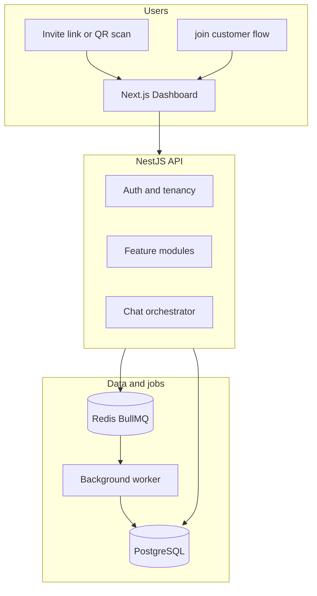
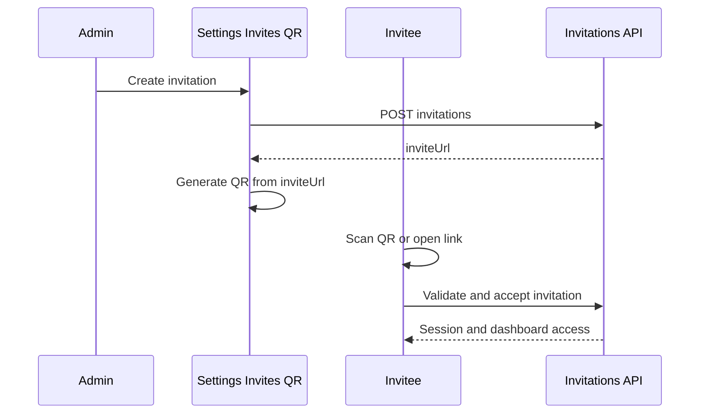
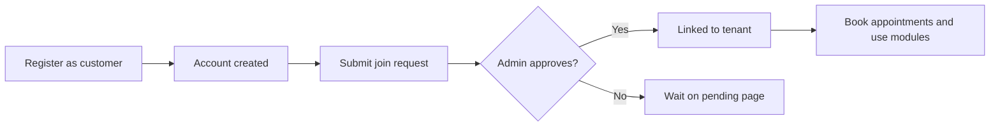
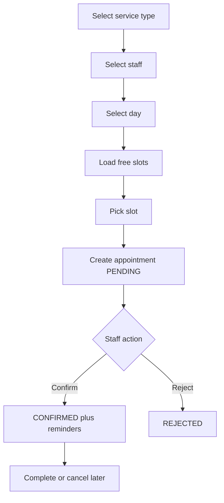
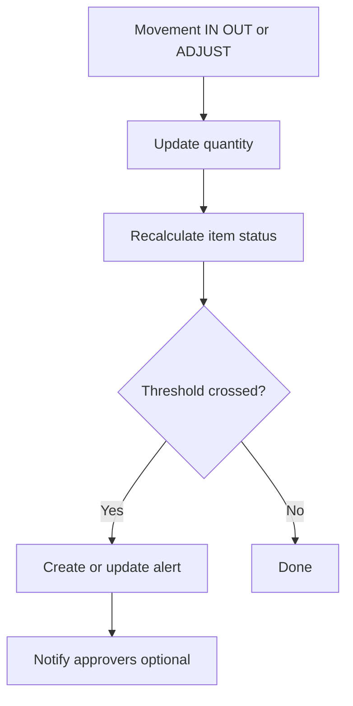
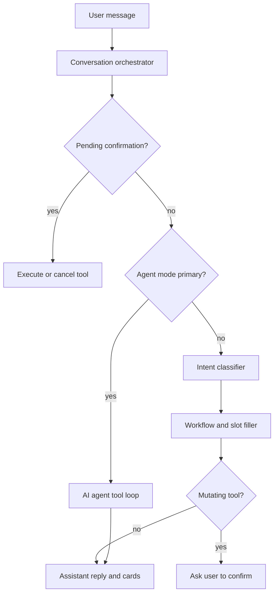
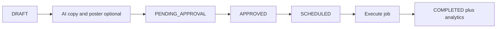
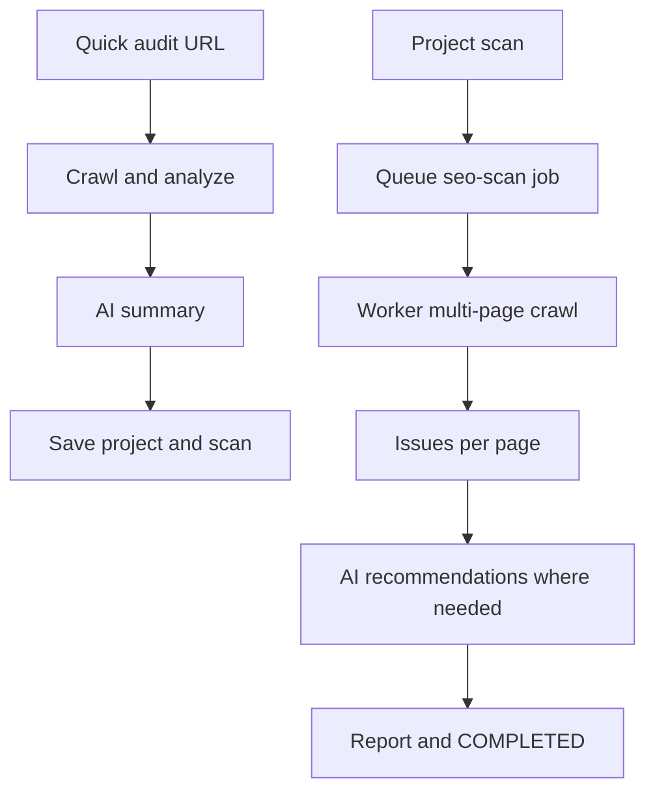
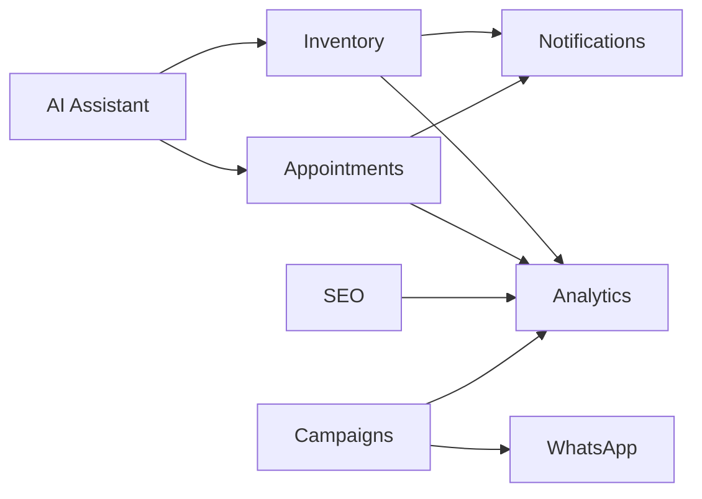

# NexaAssist — Platform Report: What We Built & How It Works

> **Forward this report:** Open `NEXASSIST-PLATFORM-REPORT.html` in any browser → **Print** → **Save as PDF** for email or slides.

**NexaAssist** — *Centralized AI-powered business operations*

NexaAssist is a **multi-tenant business operations platform**: each organization (tenant) runs in its own secure workspace with role-based access. Teams manage **scheduling, inventory, AI-assisted workflows, marketing campaigns, SEO, and messaging** from one dashboard—all sharing the same data model and permissions.

---

## Table of contents

1. [Platform at a glance](#platform-at-a-glance)
2. [Foundation: organizations, users, and access](#foundation-organizations-users-and-access)
3. [Getting people into the workspace](#getting-people-into-the-workspace)
4. [Appointments & scheduling](#appointments--scheduling)
5. [Inventory](#inventory)
6. [AI assistant (chatbot)](#ai-assistant-chatbot)
7. [Campaigns](#campaigns)
8. [SEO audit](#seo-audit)
9. [Supporting modules](#supporting-modules)
10. [How modules connect](#how-modules-connect)
11. [Dashboard map](#dashboard-map)

---

## Platform at a glance

Every feature flows through the same architecture: a **Next.js dashboard** talks to a **NestJS API** (`/api`), which reads and writes **PostgreSQL**. Long-running work (reminders, SEO scans, WhatsApp sends, campaign execution, analytics) is handled by a **background worker** connected to **Redis** (BullMQ queues).

---

## Foundation: organizations, users, and access

### Organizations (tenants)

Each business is a **tenant** with its own name, slug, and settings. All appointments, inventory, campaigns, SEO projects, and chat sessions are **scoped to that tenant**—users from one organization never see another’s data.

### Users and roles

| Role | Typical use |
|------|-------------|
| **SUPER_ADMIN** | Platform-wide administration |
| **TENANT_ADMIN** | Organization owner; full tenant configuration |
| **DOCTOR** | Clinical staff; appointments and inventory consumption |
| **RECEPTIONIST** | Front desk; booking and scheduling |
| **INVENTORY_MANAGER** | Stock, alerts, approvals |
| **STAFF** | General operations |
| **CUSTOMER** | End client; book appointments after joining an organization |

Each role receives a set of **permission codes** (for example `appointments:read`, `inventory:write`, `chat:use`). The dashboard only shows menu items and actions the signed-in user is allowed to use.

### User codes

Every user gets a readable **user code** (for example `TA-acme-clinic-001` for a tenant admin, or `CU-INV-001` for a customer not yet linked to an organization). These codes appear in the UI and in assistant conversations for quick reference.

### Sessions

Users sign in with email and password. The API issues **JWT access tokens** (short-lived) and **refresh tokens** (longer-lived). The dashboard stores tokens securely and refreshes them automatically; expired sessions require signing in again.

---

## Getting people into the workspace

NexaAssist supports several onboarding paths so businesses, staff, and customers can each enter the platform the right way.

### Onboarding paths

| Path | Who | What happens |
|------|-----|----------------|
| **Register organization** | New business admin | Creates a new tenant and a **TENANT_ADMIN** account → lands on the dashboard to configure services, availability, and invites |
| **Register customer** | End client | Creates a **CUSTOMER** account **without** a tenant → must request access to an organization before booking |
| **Join organization** | Customer | Submits a **join request**; a tenant admin **approves** it on Join Requests → customer is linked and can book |
| **Invite staff (link + QR)** | Admin | Creates an invitation in **Settings → Invites** → receives a shareable **invite URL** and an on-screen **QR code** → invitee scans or opens the link → accepts → signed in |
| **Standalone join page** | Customer | Public **`/join`** page: register and request organization access in one flow |

### Invite flow with QR code

When an admin creates an invitation, the system returns a unique **invite URL**. The dashboard generates a **QR code** from that URL in the browser (no server-side image storage). Anyone who scans the code opens the invite page, validates the token, accepts the invitation, and receives a session.

**Important:** The QR code is for **staff and customer invite links**, not for appointment check-in. Appointments use a separate display code format (**`APT-…`**) shown in lists and emails.

### Customer without an organization

Customers who register without selecting an organization are redirected to **Organization access** (`/dashboard/pending-tenant`) until an admin approves their join request. Until then, scheduling and most modules stay hidden.

### Registration flow (customer)

---

## Appointments & scheduling

### What it is

End-to-end **appointment lifecycle** for multi-staff organizations: define services, set availability, book time slots, confirm or reject requests, reschedule, complete, and receive **email reminders** for confirmed bookings.

### Where to use it

| Screen | Purpose |
|--------|---------|
| **Appointments** | List and filter all appointments; open detail |
| **Book Appointment** | Guided booking wizard |
| **Calendar** | Day, week, and month views with appointments and availability overlays |
| **Availability** | Recurring schedules, one-off slots, and leave/blocked time |
| **Service Types** | Services with duration (drives slot length) |

### Key capabilities

- **Service types** — name, duration, color; used when calculating free slots
- **Staff availability** — recurring weekly rules plus individual slots; **blocked** windows for leave
- **Free slots** — API computes bookable windows minus existing appointments and blocks
- **Appointment codes** — each booking gets a unique `APT-…` reference
- **Status lifecycle** — `PENDING` → `CONFIRMED` or `REJECTED` → `COMPLETED`, `CANCELLED`, `RESCHEDULED`, or `NO_SHOW`
- **Overlap protection** — cannot double-book the same staff member
- **History** — audit trail of status changes
- **Reminders** — after confirmation, background jobs send reminder emails

### How booking works

1. Choose a **service type** (duration).
2. Choose **bookable staff**.
3. (Staff/reception) optionally pick a **customer**; customers book for themselves.
4. Pick a **day**; the UI loads **free slots**, existing appointments, and blocked time for that day.
5. Select a slot and submit → appointment is created as **PENDING**.
6. Authorized staff **confirm** or **reject**; further actions include cancel, reschedule, and complete.

### Permissions (scheduling)

| Permission | Allows |
|------------|--------|
| `appointments:read` | View appointments and calendar |
| `appointments:create` | Book new appointments |
| `appointments:update` | Confirm, reschedule |
| `appointments:cancel` | Cancel appointments |
| `calendar:read` | Calendar views |
| `availability:read` / `availability:write` | View or edit availability and leave |
| `service-types:read` / `service-types:write` | View or manage service types |

---

## Inventory

### What it is

**Tenant-scoped stock control**: catalog items, categories, stock movements, automatic alerts, and a **restock request** workflow with manager approval.

### Where to use it

| Screen | Purpose |
|--------|---------|
| **Inventory overview** | Metrics, health, recent movements, alerts, pending requests |
| **Items** | Search, filter, create; open item detail |
| **Categories** | Organize the catalog |
| **Movements** | Audit log of all stock changes |
| **Alerts** | Low stock, out of stock, overstock |
| **Requests** | Restock requests and approval queue |

### Key capabilities

- **Items** — SKU (unique per tenant), quantity, reserved quantity, available quantity, minimum threshold
- **Status** — derived automatically: active, low stock, out of stock, etc.
- **Movements** — **IN** (receive stock), **OUT** (consume), **ADJUSTMENT** (set absolute quantity)
- **Alerts** — created when thresholds are crossed; acknowledge, resolve, or mark read
- **Restock requests** — staff submit → manager **approves** or **rejects** → **fulfill** records stock IN and closes the request
- **Dashboard metrics** — totals, low-stock count, critical alerts, movements today

### How stock changes work

### Restock request flow

1. User with `inventory:request` creates a **pending** request for an item and quantity.
2. User with `inventory:approve` sees all requests; others see only their own.
3. **Approve** or **reject** with optional notes.
4. **Fulfill** applies an **IN** movement linked to the approved request and marks the request fulfilled.

### Permissions (inventory)

| Permission | Allows |
|------------|--------|
| `inventory:read` | View dashboard, items, movements |
| `inventory:write` | Categories, items, stock IN |
| `inventory:consume` | Stock OUT |
| `inventory:adjust` | Quantity adjustments |
| `inventory:request` | Submit restock requests |
| `inventory:approve` | Approve, reject, fulfill requests; see all requests |
| `inventory:alerts` | Acknowledge and resolve alerts |

---

## AI assistant (chatbot)

### What it is

**NexaAssist Assistant** is a tenant-scoped conversational interface that can answer operational questions and **take action** on appointments and inventory—using the same business rules and permissions as the rest of the dashboard.

### Where to use it

**Dashboard → Assistant** — chat sessions, message history, interactive cards (slot pickers, booking summaries, inventory results, confirmation prompts), and quick-action suggestions.

### Assistant tools (13)

The assistant can call tools only if the user’s role grants the underlying permission:

| Tool | What it does |
|------|----------------|
| `listBookableStaff` | Staff available for booking |
| `getFreeSlots` | Free slots for a staff member and time range |
| `countAppointments` | Count appointments on a date |
| `listTodayAppointments` | Today’s appointment summary |
| `createAppointment` | Book an appointment |
| `confirmAppointment` | Confirm a pending appointment |
| `cancelAppointment` | Cancel by ID |
| `rescheduleAppointment` | Move to new times |
| `searchInventory` | Find items by name or SKU |
| `createInventoryItem` | Add a new item |
| `createRestockRequest` | Request restock |
| `createUser` | Create a user (admin) |
| `createInvitation` | Create an invite |

### How a message is processed

1. User sends a message in a **chat session**.
2. The **orchestrator** saves the message and checks for a pending confirmation (yes/no from a previous step).
3. In **primary agent mode**, an **AI agent** (via OpenRouter) may run a multi-step **tool loop** to gather data and act.
4. Otherwise an **intent classifier** routes to **workflows** (for example “book appointment”) that fill required **slots** (staff, date, time) step by step.
5. **Read-only** tools run immediately and return structured **cards** in the UI.
6. **Mutating** tools (create appointment, cancel, inventory changes, invites) require the user to **confirm** before execution.
7. The assistant reply is saved with metadata for cards, suggestions, and audit.

### Guardrails

- **Role-based access** — each tool checks permissions; unavailable tools are never offered.
- **Explicit confirmation** — creates, cancels, reschedules, inventory writes, and invites need user approval.
- **Tenant scope** — scheduling and inventory calls respect the user’s organization (customers must belong to a tenant).
- **Audit** — tool calls and outcomes are logged for traceability.

### Permission

| Permission | Allows |
|------------|--------|
| `chat:use` | Open Assistant and send messages |

---

## Campaigns

### What it is

**Marketing campaigns** inside the tenant: objectives, audience, budget, approval workflow, AI-generated copy and posters, scheduling, execution, and per-campaign analytics.

### Where to use it

**Dashboard → Campaigns** — list, create, edit, request approval, schedule, execute, and view assets and performance.

### Campaign lifecycle

| Status | Meaning |
|--------|---------|
| `DRAFT` | Being edited |
| `PENDING_APPROVAL` | Awaiting manager approval |
| `APPROVED` | Approved; can be scheduled |
| `SCHEDULED` | Set to run at a scheduled time |
| `ACTIVE` | Running |
| `COMPLETED` | Finished |
| `PAUSED` / `REJECTED` / `ARCHIVED` | Stopped or archived |

### How campaigns work

1. **Create** a campaign with objective, audience, and content fields (draft).
2. Optionally generate **AI marketing copy** and a **poster image** (stored as campaign assets).
3. **Request approval** → approver **approves**, **rejects**, or sends back for revision.
4. **Schedule** or **execute** the campaign.
5. On execution, a **background job** runs the campaign: delivers in-app broadcast simulation, updates status to completed, and records **impressions** and analytics.
6. **WhatsApp batches** can optionally link to a `campaignId` for coordinated outreach.

### Permissions (campaigns)

| Permission | Allows |
|------------|--------|
| `campaigns:read` | View campaigns |
| `campaigns:write` | Create and edit |
| `campaigns:approve` | Approve or reject |
| `campaigns:send` | Schedule and execute |

---

## SEO audit

### What it is

**SEO auditing** for websites: crawl pages, run rule-based checks, score pages, surface issues, and enrich results with **AI-written recommendations** and summaries.

### Where to use it

**Dashboard → SEO Audit** — quick single-URL audit, **projects** (domains), multi-page **scans**, issue lists, compare scans, and reports.

### Two audit modes

#### Quick audit (immediate)

1. User enters a **URL**.
2. System **crawls** the page, runs the **analyzer** (titles, meta, headings, links, performance estimates, etc.).
3. **AI** produces a narrative summary: what is good, what to fix, grouped categories.
4. Results are **saved** as a project, scan, page record, and issues.

#### Project scan (background)

1. User creates or opens an **SEO project** (site/domain).
2. User triggers **Scan** → scan status moves to queued.
3. **Worker** crawls up to configured depth, discovers linked pages, analyzes each page.
4. Pages with issues may receive **AI recommendations** per page.
5. Scan completes; **report** summarizes scores and issue counts.

### Permissions (SEO)

| Permission | Allows |
|------------|--------|
| `seo:read` | View projects, scans, reports; run quick audit |
| `seo:write` | Create projects and trigger multi-page scans |

---

## Supporting modules

### WhatsApp

**Dashboard → WhatsApp**

- **Message templates** with `{{variable}}` placeholders.
- **Batches** of recipients; optional link to a **campaign**.
- Messages are **queued**; a worker sends in chunks (up to 50 per batch step) and updates delivery status.
- When **Meta Cloud API** credentials are configured, sends go through WhatsApp; otherwise the platform **simulates** send for development and demos.
- **Retry** failed messages; **webhook** updates delivery state.

### Analytics

**Dashboard → Analytics**

- **Overview KPIs**: appointments, users, active campaigns, SEO projects.
- **Module dashboards**: appointments, inventory, campaigns, **chatbot** (sessions and tool usage), SEO.
- **Aggregation worker** rolls up daily metrics and snapshots; manual aggregate trigger available to admins.

### Notifications

**Dashboard → Notifications**

- In-app notifications from **domain events** (appointments, inventory alerts, join requests, system events).
- Bell icon in the shell; full list on the notifications page.

### Operations

**Dashboard → Operations**

- **Queue health** and **failed job** lists across BullMQ queues (campaigns, WhatsApp, SEO, analytics, appointments, inventory, etc.).
- **Retry** individual failed jobs (admin/operations permission).

### Users, settings, and modules

| Screen | Purpose |
|--------|---------|
| **Users** | List and manage tenant users |
| **Join Requests** | Approve or reject customer access |
| **Settings** | Organization profile, user invites, **QR codes** for invite links |
| **Modules** | Tenant module configuration |

---

## How modules connect

Features are separate modules but share data and workflows:

| From | To | Connection |
|------|-----|------------|
| **Assistant** | Appointments, Inventory | Books, confirms, searches stock via same APIs as the UI |
| **Campaigns** | WhatsApp | Batches can reference a campaign ID |
| **Campaigns** | Analytics | Impressions and campaign metrics |
| **SEO** | Analytics | SEO project and scan KPIs |
| **Appointments** | Notifications, Analytics | Events, reminders, metrics |
| **Inventory** | Notifications, Analytics | Alerts, restock events, stock metrics |

**Dashboard navigation groups** (sidebar):

- **Scheduling** — Appointments, Calendar, Availability, Service Types, Book Appointment  
- **Operations** — Inventory, Operations (queues)  
- **Assistant** — AI chatbot  
- **Marketing & Growth** — Campaigns, WhatsApp, SEO Audit, Analytics  
- **Admin** — Users, Join Requests, Notifications  
- **System** — Settings (invites + QR), Modules  

---

## Dashboard map

Routes appear only when the user has the required permission and (for customers) is linked to an organization.

| Group | Route | Permission (typical) |
|-------|-------|----------------------|
| Home | `/dashboard` | Signed in |
| Scheduling | `/dashboard/appointments` | `appointments:read` |
| Scheduling | `/dashboard/calendar` | `calendar:read` |
| Scheduling | `/dashboard/availability` | `availability:read` |
| Scheduling | `/dashboard/service-types` | `service-types:read` |
| Scheduling | `/dashboard/booking` | `appointments:create` |
| Operations | `/dashboard/inventory` | `inventory:read` |
| Operations | `/dashboard/operations` | `operations:read` |
| Assistant | `/dashboard/assistant` | `chat:use` |
| Marketing | `/dashboard/campaigns` | `campaigns:read` |
| Marketing | `/dashboard/whatsapp` | `whatsapp:read` |
| Marketing | `/dashboard/seo` | `seo:read` |
| Marketing | `/dashboard/analytics` | `analytics:read` |
| Admin | `/dashboard/users` | `users:read` |
| Admin | `/dashboard/join-requests` | `join-requests:manage` |
| Admin | `/dashboard/notifications` | `notifications:read` |
| System | `/dashboard/settings` | `tenants:update` |
| System | `/dashboard/modules` | `tenants:update` |
| Customer pending | `/dashboard/pending-tenant` | Customer without tenant |
| Public | `/join` | Customer registration + join |
| Public | `/invite/[token]` | Accept staff/customer invite |

### Analytics sub-routes

| Route | Focus |
|-------|--------|
| `/dashboard/analytics/appointments` | Scheduling metrics |
| `/dashboard/analytics/inventory` | Stock metrics |
| `/dashboard/analytics/campaigns` | Campaign performance |
| `/dashboard/analytics/seo` | SEO scan metrics |

### Inventory sub-routes

| Route | Focus |
|-------|--------|
| `/dashboard/inventory/items` | Item catalog |
| `/dashboard/inventory/categories` | Categories |
| `/dashboard/inventory/movements` | Audit trail |
| `/dashboard/inventory/alerts` | Stock alerts |
| `/dashboard/inventory/requests` | Restock workflow |

---

*NexaAssist — everything above is live in the product today: multi-tenant workspaces, registration and invite QR onboarding, scheduling, inventory, AI assistant, campaigns, SEO, WhatsApp, analytics, and operations tooling in one platform.*
